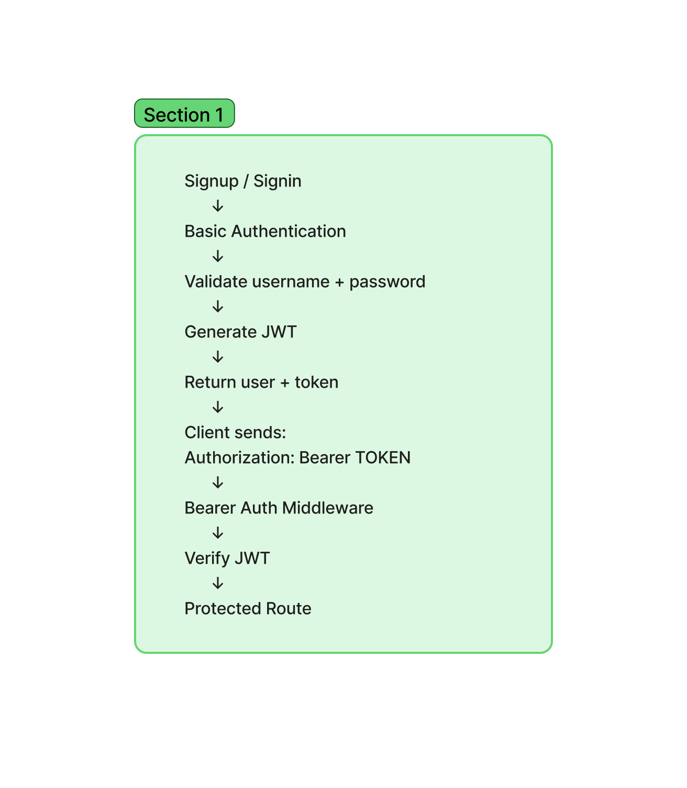

# Bearer Authentication

## Author

Luis Lopez

## Description

This project is an authentication server that supports user signup, Basic Authentication, and Bearer Authentication using JSON Web Tokens (JWT).

A user can create an account or sign in with a username and password. After successful authentication, the server generates a signed JWT. The token can then be sent in the Authorization header to access protected routes.

This project builds on Basic Authentication by allowing authenticated users to use a Bearer token for future requests.

## Features

- User signup
- Basic Authentication for signin
- Password hashing with bcrypt
- JSON Web Token generation
- Bearer Authentication middleware
- Protected routes
- Sequelize User model
- PostgreSQL database support
- SQLite in-memory database for testing
- Automated Jest tests

## Routes

### POST /signup

Creates a new user and returns the user information with a JWT.

### POST /signin

Authenticates a user using Basic Authentication and returns the authenticated user with a JWT.

### GET /users

Protected route that requires a valid Bearer token and returns a list of usernames.

### GET /secret

Protected route that requires a valid Bearer token.

## Bearer Authentication

After a successful signup or signin, the server generates a signed JSON Web Token.

The client can use the token in future requests with the following header:

`Authorization: Bearer <token>`

The Bearer Authentication middleware verifies the JWT before allowing access to protected routes.

## JWT Security

This application implements configurable JWT security measures.

### Token Expiration

JWTs expire after a configured period. The default expiration is 15 minutes.

The expiration can be configured with:

`TOKEN_EXPIRES_IN`

### Restricted Signing Algorithm

JWT signing and verification use a configured algorithm. The default is HS256.

The algorithm can be configured with:

`TOKEN_ALGORITHM`

During verification, the application restricts accepted tokens to the configured signing algorithm.

## Environment Variables

The application uses environment variables for configuration.

- `DATABASE_URL` - PostgreSQL database connection URL
- `SECRET` - Secret used to sign and verify JWTs
- `PORT` - Server port
- `TOKEN_EXPIRES_IN` - JWT expiration period
- `TOKEN_ALGORITHM` - JWT signing algorithm

Sensitive environment variables should not be committed to the repository.

## Testing

Tests are written with Jest.

Run the test suite with:

`npm test`

The test suite includes authentication middleware, route handlers, routes, and independent User model tests.

## UML

The following diagram shows the authentication and Bearer token flow.

## Deployment

Deployment URL: https://bearer-auth-9175.onrender.com

## Pull Request

Merged pull request: https://github.com/metswin17/bearer-auth/pull/1
